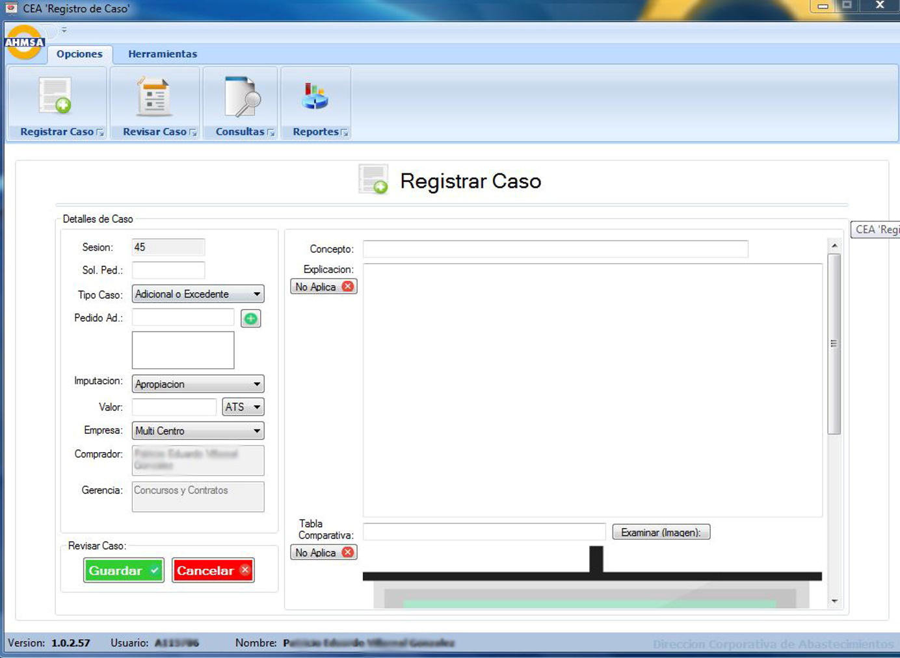
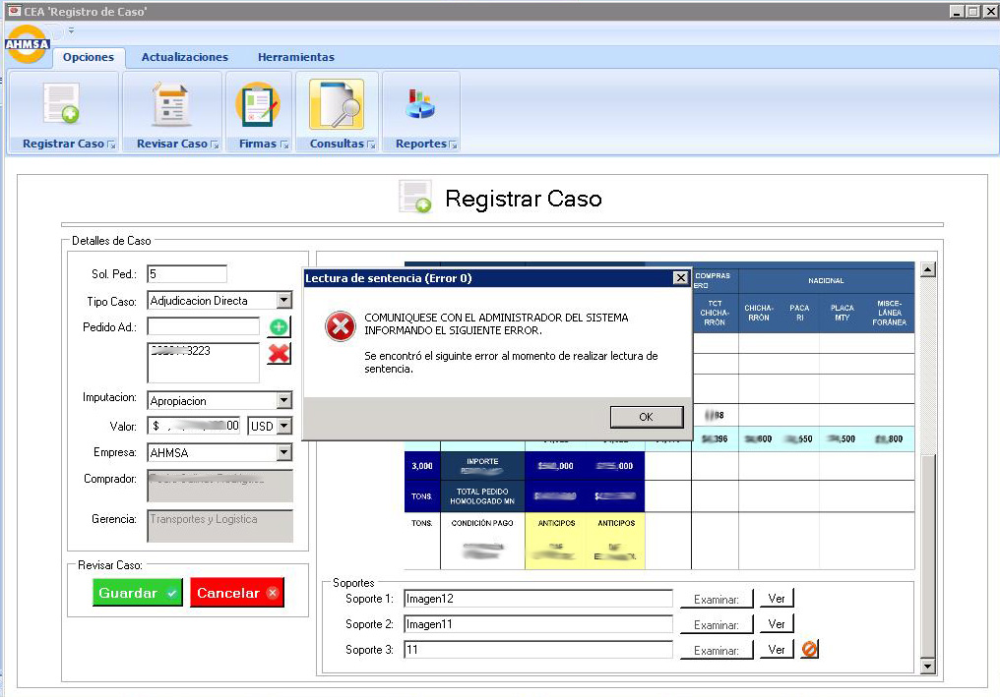
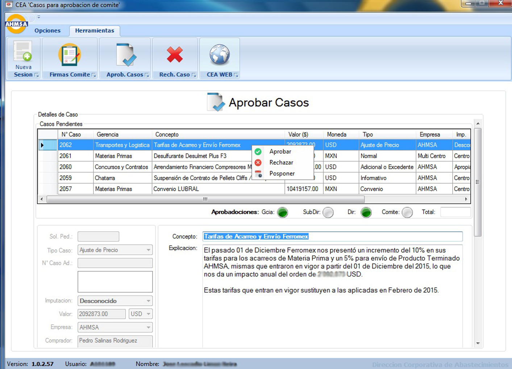

# 🧾 CEA – Comité de Evaluación de Adquisiciones

## 🧭 Overview
**CEA** is a robust internal Windows application developed in **C#** and **SQL Server** using **Visual Studio** at AHMSA to streamline high-value procurement request workflows.  
The system digitizes the manual process of preparing, approving, and reviewing purchase cases exceeding 500,000 MXN for weekly director-level meetings.

It replaced Excel files, screenshots, and PowerPoint presentations used for procurement review committees, drastically improving control, transparency, and traceability.

### Register case

### Approve cases screen

## 💡 Idea & Concept
The system automates an error-prone workflow that included:
- Collecting purchase cases via email
- Building weekly PowerPoint slides for director meetings
- Manually tracking who approved each request
- Relying on screenshots and inconsistent documentation

CEA centralizes this in a secure, session-based system with automated approval flows and presentation export.

## ✨ Features & Functionality
- 🔐 Login with multi-environment support (DEV/QAS/PRD)
- 🚫 3-failure lockout, screen restrictions, and singleton session per user
- 🆕 Register New Cases with:
  - Title, type, value, currency, vendor, contract linkage, cost code
  - Screenshots (stored as images in DB), justification, documents
- 🔁 Approval Flows:
  - Auto-notifies managers, sub-directors, director of purchasing
  - Auto-disables edits after approval
- 🧾 Session Logs:
  - Session numbers grouped per week; used for meeting prep
- 📊 Admin Tools:
  - Create weekly sessions
  - Lock system for updates
  - Broadcast urgent messages
  - View version and force-close users if needed
- 📤 Crystal Reports generator to create the official PDF of approved cases
- ✅ Post-meeting review: Approve/reject/postpone by committee

## ⚙️ Tech Stack
- **Language:** C#
- **Framework:** .NET WinForms
- **Database:** SQL Server
- **Reporting:** Crystal Reports
- **IDE:** Visual Studio

## 🏗 Architecture & Design
- RibbonBar interface with embedded screen routing
- Modular design per session, case registration, approvals, and reporting
- Admin tab for emergency controls and infrastructure monitoring
- Screens are embedded via child-form architecture

## 🚀 Installation & Setup
- **Deployment:** Internal Windows machines via shared folder
- **Startup:** Auto-start with singleton check
- **Permissions:** Role-based: purchasers, managers, admin

> **Note:** All media and logs are saved securely in the database for auditing.

## 🧑‍💻 My Role & Contributions
- 💼 Sole developer and architect
- 🧱 Designed schema, reports, approval flows, and logic from scratch
- 🧠 Developed admin tools and usage tracking
- 🔄 Integrated **[CEA Web](https://github.com/HermiloOrtega/CEA-Web)** and **[CEA Offline](https://github.com/HermiloOrtega/CEA-Offline)** compatibility

## 🧗 Challenges & Learnings
- Migrated fully manual Excel/PPT process to an automated app
- Built resilient approval workflows and embedded media management
- Designed fallback session logic and forced logout/update functions
- Handled complex logic for reporting and role-based review screens

## 📈 Future Enhancements
- Integrate digital signature support
- Replace Crystal Reports with modern PDF exports
- Migrate UI to web or hybrid for directors' mobile devices

## 🪪 License
⚠️ **Internal Use Only**  
Originally published under MIT; changed to **CC BY-NC-ND 4.0** as of April 22, 2025.

## 🔗 Related Projects
- **[CEA](https://github.com/HermiloOrtega/CEA)**
- **[CEA Web](https://github.com/HermiloOrtega/CEA-Web)**
- **[CEA Offline](https://github.com/HermiloOrtega/CEA-Offline)**
